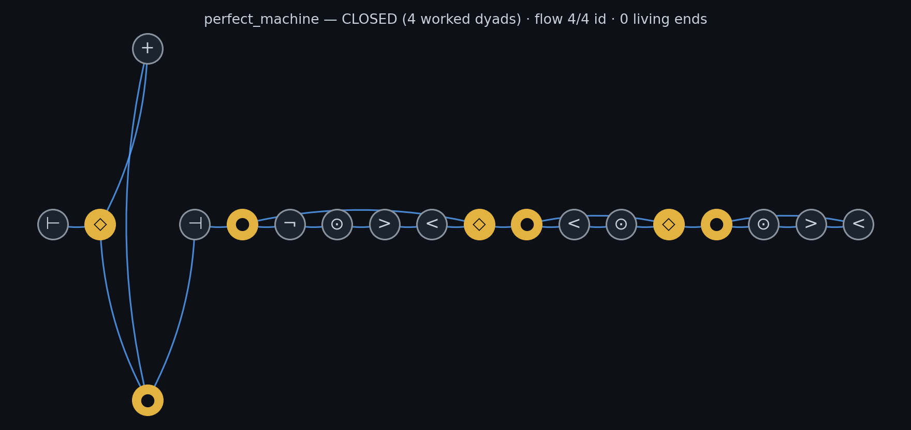

# The Imscriber's Guide to IMASM

**What it is.** The single comprehensive reading of IMASM: the 12-opcode classic
tower and the 14-opcode SIXTEEN_3 trilattice extension presented as one continuous
grammar family, statics and dynamics together. It coagulates the former
`IMASM_QUICKREF.md`, `IMASM_DYNAMICS.md`, and `md/imasm_composition_rules.md`
into one document.

**What it does.** Teaches everything needed to write, wire, judge, run, compose,
and survey IMASM programs: the alphabet, how a word becomes a graph, the ancestry
pairing rule, the close condition, the four verdicts, the register and the gates,
the three-verdict discipline, the composition law, ChaosComposer, the op-opcode
level, the 49 types, and where the engine itself lives and runs.

**Why it matters.** IMASM is the Grammar's executable face: a decision expressed
as a word and put to `check` receives a univocal structural verdict, and the same
close condition that judges reasoning here is the gate that judges the vita
trunk's speech on bare metal. One grammar, one judge, every substrate.

**How to use it.** Read Parts I to III to write and judge words; Part IV onward
for dynamics, composition, and the wider machinery. Semantics track
`ask_native/src/imasm.rs` and `imasm_core/src/check.rs`; run `imasm ref` for the
live rules. Where this guide and a live tool ever disagree, the tool is right.

---

## Part I. The Alphabet

A program is a DIRECTED GRAPH of opcodes, not a line. One glyph each; the
alphabet is fully SYMBOLIC (no Latin initials, so no token ever collides with a
verdict letter). WORK? asks: does the opcode TRANSFORM the object?

The classic core is twelve opcodes; the trilattice face adds the tri-dyad (∈, ∋)
and the two bit-swap negations, and reads ⊞ as EVALI. Every classic dyad (◇/●)
is the arity-2 special case of a tri-dyad (∈/∋); same ancestry rule, same close
condition, same register.

```
 GLYPH NAME      MEANING                                VALENCE   WORK?
  ⊢   VINIT     begin / source boundary                 0→1        no   the only source
  ⊣   TANCH     terminal anchor / close boundary        1→1        no   sink; out-port may stay open
  >   AFWD      forward morphism                        1→1        YES
  <   AREV      reverse morphism (involution T↔F, t↔f)  1→1        YES
  =   CLINK     compose / link                          1→1        YES
  ⊙   IMSCRIB   identity / self-reference               1→1        no   the neutral generator
  ◇   FSPLIT    fork (δ): ONLY classic brancher         1→2        no
  ●   FFUSE     fuse (μ): ONLY classic merger           2→1        no
  ∈   FSPLIT3   3-way split (δ₃): T/F/I arms            1→3        no   ONLY tri-brancher
  ∋   FFUSE3    3-way fuse (μ₃)                         3→1        no   ONLY tri-merger
  +   EVALT     evaluate TRUE arm / set T               1→1        YES
  ×   EVALF     evaluate FALSE arm / set F              1→1        YES
  ⊞   ENGAGR/EVALI  hold paradox (classic) / set t,f    1→1        YES
  ~   TNEG      negation: swaps T ↔ F                   1→1        YES  (16_3 only)
  ≁   INEG      con-negation: swaps t ↔ f               1→1        YES  (16_3 only)
  ¬   IFIX      irreversible commit / fix               1→1        YES
```

The WORK? column is the most-missed rule: ⊢ ⊣ ⊙ ◇ ● ∈ ∋ do NOT transform. An
arm carrying only ⊙ (or nothing) is an identity arm, and a closure over identity
arms verifies nothing. ⊙ is self-reference, not work.

WORDS: tokens glued as one string, no spaces, e.g. `⊢>◇+⊙●¬⊣`. Space-separated
full names parse identically (VINIT AFWD ...), as do the short forms
VI TA AF AR CL IM FS FF ET EF EG IX and the aliases δ μ ═ for ◇ ● =.

RETIRED: the letter codes V/T/B and ← (the old IMSCRIB) no longer parse. A word
using a retired code reads as empty and reports N (void). Brackets [ ] are never
input; they parse to nothing and yield N (void).

Glyph provenance: the alphabet is not invented. It references the per-token glyph
vocabulary fixed in `../ob3ect/READING_GUIDE.md` §3 (five are the guide's own
midpoint glyphs; IFIX is its stated "fix (¬)"; AFWD/AREV are its forward/reverse
arrows). The remaining tokens are symbolic by the same principle rather than
initials: VINIT ⊢ and TANCH ⊣ are the opening and closing boundary turnstiles,
ENGAGR ⊞ is the Belnap Both it holds, and IMSCRIB is ⊙ because imscribing IS
INCLOSURE, the monadic operation itself, hence self-referential and referenced
self-referentially: a boundary around its own centre, denoting the act of
denoting. Its appearance as Criticality in the 12-primitive notation is the same
structure surfacing wherever inclosure closes on itself, not a collision.
Valences follow IMSCRIBr `tokens.py::TOKEN_ARITY`.

## Part II. From Word to Graph

A word is only the node list. The EDGES are supplied by the verb you build with:

```
  chain <word>           wire head→tail, nothing reconnects        (β=0, one strand)
  ring <word>            wire head→tail→head; fork/fuse NOT rejoined (β=1)
  protocol <word>        wire so ◇/● pairs RECONNECT (δ arm → μ): the way to CLOSE
  bubble PRE:A:B:POST    ◇→(A|B)→● reconvergence, spelled out
  star CORE:a:b:c        hub + arms (≥3)
  comb BACKBONE:p arm:q arm   backbone + grafts
  wire N0 N1 … / i-j i-k …    free graph: node set / edge set
```

Same word + different verb = different graph = different verdict.
`chain ⊢◇+×●⊣` and `protocol ⊢◇+×●⊣` are not the same program. To CLOSE, use
`protocol`, never a bare `ring`, and never close by looping back to ⊢ (a source,
in-arity 0).

### Which ◇ pairs with which ●

By ANCESTRY, not by text position and not by a fork-balance stack. A (◇,●) pair
exists when two distinct in-arms of the ● trace back to a common ◇: the fork was
undone by the fuse, HOWEVER IT ROUTED. Consequences:

- Pairing is a property of the EDGES, so the same word wired two ways pairs
  differently. You cannot read pairing off the glyph string alone.
- A ◇ feeding a ● directly (empty arm) still counts: in-edges are counted with
  multiplicity, and a ◇ is its own ancestor.
- Arms are the nodes strictly between ◇ and ●: forward-reachable from the fork
  AND backward-reachable from the fuse. That set is what gets checked for WORK.
- A ● may have SEVERAL qualifying ◇ (upstream forks reach downstream fuses on
  any strand). It pairs with the INNERMOST: the candidate no other candidate
  descends from. So a ◇ may close more than one ●, but a ● closes with exactly
  one ◇, and an upstream fork cannot claim the fuse a nearer fork actually forked.
- fully_closed means EVERY ◇ and EVERY ● participates in some pair. One dangler
  and the whole program is Open.

The tri-ancestral rule is the arity-3 generalization: a (∈,∋) pair exists when
ALL THREE distinct in-arms of the ∋ trace back to a common ∈. Same innermost
rule, same multiplicity rule. Neutral inflation is allowed: `⊢∈⊙⊙⊙∋⊣` is valid
tri-reconnection with no work, and reads N (identity), the same as `⊢◇⊙⊙⊙●⊣`.

For a plain strand the stack reading (each ● takes the nearest unfused ◇)
happens to agree, and such words may be bracketed for READING BY EYE:
`⊢⊙=[◇>+<⊞×●]¬¬⊣`, nesting as nested brackets. Three caveats, all load-bearing:
brackets are NOT input (they parse to nothing, so a bracketed word reports
N void); the aid works for strands ONLY; and it is not the pairing rule.
Ancestry is. The two coincide on a strand and part company the moment edges
route otherwise.

## Part III. The Close Condition and the Verdicts

A program CLOSES iff BOTH hold:

1. RECONNECTION: every brancher (◇ or ∈) and every merger (● or ∋) participates
   in an ancestry pair, and
2. TRANSFORMATION: at least one such pair carries a WORK opcode on its arms.

A bare cycle is NOT a closure; β (loops) is never diagnostic. Split→fuse with
nothing between is μ∘δ=id, which type-checks nothing. The close condition is
μ∘δ over a TRANSFORMED object: split, work, fuse.

### Verdicts (from `check` / `imasm16_3 check`, identical logic)

```
  T (closes)        μ∘δ closes over n transformed reconnections → proceed
  N (identity)      ◇/● reconnect but no WORK between → put work on the arms
  N (no fork)       no δ/μ dyad at all → never weighed alternatives
  N (void)          no committed opcodes: nothing parsed → write a real word
  B (open)          well-typed, but a ◇ or ● dangles unreconnected → fuse it (●)
                    or commit one arm (¬)
  B (paradox held)  closes over a transformation AND a ⊞ is present → genuinely
                    both. Sound to hold; do NOT read it as a clean T; look again
                    before an irreversible ¬.
  F (ill-typed)     grammar violated → revise
```

B BEATS T: a word that closes but contains ENGAGR reports B, never T. Holding a
paradox is sound, but it is not a clean pass.

F is exactly three errors: a non-brancher fanning out, a non-merger merging in,
or any node exceeding its own arity. Nothing else is fatal.

OPEN VALENCES ARE NOT ERRORS. An arm that runs out of successors is a living /
telechelic end: reported as "open valences (living ends): n out, m in; reactive,
not errors". ⊣ may end with its out-port open; ⊢ may start with its in-port open.

### Topology names (from `classify`)

Named by invariants, not by fork balance. β = E − V + C (independent loops):

```
  trivial   no nodes
  linear    β=0, no branch points: a single strand
  star      β=0, branch points forming ONE contiguous hub, ≥3 arms
  comb      β=0, branch points strung along a backbone: graft/comb tree
  ring      β=1, no branch and no merge points: single cycle, no pendants
  branched  β=1 with branch or merge points
  network   β≥2, or more than one disconnected strand
```

Reported with: V, E, β, branch/merge/src/sink census, arm count, and spectral
radius ρ. Star caveat: the abstract star K(1,f) has ρ=√f, but IMASM fan-out caps
at 2 (◇ is out-2), so a hub is REALIZED as a caterpillar of f−1 ◇ fan-nodes and
the true ρ tends to 2, not √f.

## Part IV. The Carrier and the Gates (dynamics)

The register is a SIXTEEN_3 value: a subset of the four base values {T, F, t, f}
(Shramko, Dunn and Takenaka's trilattice, "The Trilattice of Constructive Truth
Values", J. Logic and Computation 11(6):761-788, 2001; T constructively proven,
F constructively refuted, t acceptable, f rejectable), sixteen states from
N = {} to A = {T,F,t,f}. FOUR is not a second system: it is the classical slice
{T, F} of the same carrier, with Belnap B = {T,F} and N = {}. One evaluator runs
both; `eval` renders the slice (N/T/F/B), `eval16` renders the full names. A
value that touches t or f has left the slice and keeps its 16_3 name in either
view. NOT two independent FOURs, NOT three independent bits: one 4-bit register,
verified against the paper's own worked example (T ∧ t = N under the truth order).

Three orderings, each with a meet/join (`imasm16_3 algebra <op> A B`):

```
  ≤_i information     x ⊆ y                                            ⊓/⊔
  ≤_t truth           x∩{T,t} ⊆ y∩{T,t}  and  y∩{F,f} ⊆ x∩{F,f}        ∧/∨
  ≤_c constructivity  x∩{T,F} ⊆ y∩{T,F}  and  y∩{t,f} ⊆ x∩{t,f}        △/▽
```

Flow uses ≤_i: shuttling only ever moves values up the information order.
TNEG/INEG are both bit-SWAPS (not flips) on purpose: the paper requires
trilattice negation to preserve ≤_i exactly, and swapping two bits preserves
|x|; a flip would not.

### The gates

Every opcode is a gate over the carrier. Inputs join by union (the ≤_i join)
before the gate acts; the value leaving a gate rides every out-edge except where
δ fans.

```
  VINIT ⊢          emits the seed (default B in the slice, A in full 16_3)
  FSPLIT ◇         δ fans: truth part x∩{T,t} on arm one, falsity part x∩{F,f} on arm two
  FSPLIT3 ∈        δ₃ fans into the three constructive/informational projections
  EVALT +          pass-gate: truth part
  EVALF ×          pass-gate: falsity part
  EVALI ⊞ (16_3)   sets the information layer (t and f)
  FFUSE ● / ∋      μ / μ₃ joins: union of the arms
  AREV <           the involution T↔F, t↔f (its own inverse; fixes B and N)
  TNEG ~ / INEG ≁  the two bit-swaps of the trilattice
  AFWD >, CLINK =, IMSCRIB ⊙, ENGAGR ⊞ (as hold)   carry
  IFIX ¬           carry and latch (the commit point)
  TANCH ⊣          readout
```

Every gate is monotone in ≤_i, so evaluation is a Kleene iteration from all-N
edge values that settles in bounded rounds on any graph, cycles included. A loop
converges; it cannot oscillate. The machine's registers are the edges; IFIX
marks where value becomes commitment.

## Part V. The Three Independent Verdicts

A program earns three judgments, none implying another:

1. **Grammar** (`define`): the composition laws hold; only branchers branch,
   only mergers fuse, arities respected.
2. **Kernel** (`prove`): the closure class goes to the live p4ramill kernel. A
   worked dyad (split, transform, fuse) proves green; a bare fork-fuse is an
   identity closure and returns N for the program; a dangling fork is OPEN.
3. **Flow** (`eval` / `eval16`): per dyad, does the fuse RECOVER what the fork
   was fed? The canonical protocol word (`⊢◇>●+` as VINIT FSPLIT AFWD FFUSE
   EVALT) is lossless: B splits to (T,F) and fuses back to B, the operational
   split_fuse_id. The same shape with AREV on the truth arm closes in structure
   and fails in value: fed Tf, recovered Ff, NOT id. The arm inverted what it
   carried, and only flow can see that.

Flowing a catalog entry expands its twelve glyph types into opcode motifs, and
the per-dyad id/NOT-id sequence is a FLOW SIGNATURE: a readout of the tuple in
the dynamic register. Signatures discriminate between entries, and a lossy dyad
inside a kernel-green closure is not presumed a defect; it can be the entry's
chirality speaking in flow.

Discipline for any new program: define (grammar), prove (kernel), eval (flow),
and SPEAK THE EXPECTED READOUT BEFORE RUNNING EVAL. The gates are deterministic,
so the true name of a topology includes its flow.

## Part VI. The Composition Law

Programs interact end-to-valence. A living end is an unfilled port (a node below
its arity), the same reactive ends the engine always reported; they are the
register ports of the program as a component. `imasm compose <new> <A> <B>`
binds A's free out-ends to B's free in-ends, in node order, under three rules:

1. Composition CONSUMES valences and never mints one.
2. The composite must re-satisfy the grammar; an ill-typed binding is refused
   whole.
3. A program with no living ends does not compose. It is a finished loop; it is
   done.

Composites persist as wire specs, rebuild through the identical parse, and
remain composable while ends remain. Composition is therefore well-founded: each
step consumes ends, ends are finite, and the fixed point is a program with none.
This is the thesis (no lines, only loops, and autopoiesis) running as type
discipline: lines are the composable phase, loops are results, and the registry
census confirms it at scale, with roughly half the tools reactive material and
half finished loops.

## Part VII. ChaosComposer: the Possibility State Space

`chaos` takes a SET of programs (up to six). A set has no order, so the composer
walks every ordering, folds each through the binding law, and speaks the space
whole: which arrangements are admitted, which are refused and by which missing
end, and the collapse of orderings into OUTCOME CLASSES keyed by topology,
closure, flow, readout, and remaining living ends. The collapse is the
measurement: the space of possibilities is smaller than the space of orderings,
and the ratio says how constrained the set is. Refusals are results of equal
rank; a set of finished loops refuses every ordering, which is the type verdict
"these objects are done."

### Laws of flow found by walking spaces

- **Closure and flow-perfection can be in tension.** In one measured set,
  exactly one arrangement of twenty-four closed, a different one was
  flow-perfect, and none was both: closing forced a value through a lossy dyad.
- **The tension is not a law of the alphabet.** A census over sampled
  machine-shaped sets found spaces with closures, spaces with perfect flow, and
  a minority with both.
- **Perfect machines exist.** One set's whole possibility space is terminal
  objects: every admitted arrangement is CLOSED, flow-perfect, and ends with
  zero living ends. One is minted as `perfect_machine`, kernel green, every fuse
  recovering B.
- **The mechanism is exact.** The involution fixes B and N, so AREV costs
  nothing while an invol-symmetric value flows; it mints the missing pole when
  fed a PROJECTED value (invol(T) = F). Therefore AREV is lossless exactly on
  invol-symmetric values, and closure/flow tension appears precisely where a
  projection feeds an inversion. Both conditions are readable off the program
  before it runs, so an arrangement's capacity for perfection is part of its
  true name, speakable in advance and confirmable by the tools.



## Part VIII. Op-Opcodes: Operators on Words, Not Nodes

A node-opcode is a symbol inside a word; a VERB turns a word into a graph. An
OP-OPCODE is a third thing: a map that acts on the whole composition and returns
another composition. It is NOT one of the opcodes, and appending its name as a
token does nothing; it is not a node. It transforms the word.

**ROTAT**: the cyclic shift of a ring, rotate the word by one, k → k+1. The ring
automorphism. ρ and every spectral invariant are ROTAT-invariant (that
invariance IS the signal that ROTAT is a symmetry, not that it is inert). On ONE
ring it changes nothing measurable; between TWO rings being bound it sets their
RELATIVE phase, the degree of freedom that seats a junction two same-handed
(isotactic) rings cannot close on their own (the θ=0.50 co-typing termination).
ROTAT is the Weyl-Heisenberg shift X on ℤ/dℤ; the SIC displacement D_{a,b}
carries ROTAT^a. The balanced tiling of a period-n cycle is unique UP TO ROTAT.

Op-opcodes are open: ROTAT is the first named one. Its relatives are reflection
(the half-period involution ROTAT^{d/2}) and the register negations TNEG/INEG,
which act on the register rather than the word. The class was surfaced by the
necessity of binding two isotactic rings; no node-opcode rotates one ring
against another, so the operation had to live one level up, on the word itself.

## Part IX. The Types: the Strange Loop

Every TYPE the Grammar writes with is itself a full IMASM program. `imasm types`
lists the 49 Shavian type names (ado, air, ash, awe, ...); `imasm expand <type>`
locates the `the_primitive_type_called_<name>` ob3ect, pulls its ordered
bootstrap opcodes and fork/fuse pairs, and hands back the reconstructed graph
plus the per-step domain actions. The types judge programs, and the types ARE
programs judged by the same close condition: the strange loop is not decoration,
it is the autopoietic floor of the system.

## Part X. Where the Engine Lives

The close-condition engine (Graph, ancestry pairing, ClosureState, and the whole
gate `word_verdict`) lives in `imasm_core/src/check.rs`: no_std + alloc, so the
verdict can be spoken wherever the kernel runs. `ask_native/src/imasm.rs` keeps
presentation, spectral analysis, and the tool registry as extensions over the
core Graph, and is the tool that answers `imasm check`. The tri-ancestral
verdict lives beside it in `imasm_core/src/imasm16_3.rs`.

The same engine runs on bare metal: mOMonadOS carries imasm_core, and its
on-board vita mouth (the vae_vita trunk baked to a raw blob and reimplemented in
no_std scalar f32) speaks certified turns whose words are gated by
`check::word_verdict` or, when the word carries tri tokens, the tri-ancestral
verdict. The kernel that judges your reasoning at the prompt is byte-for-byte
the kernel that judges the trunk's speech on the machine with no OS beneath it.

## Part XI. The Surface and the Guarantees

`imasm_composer.html` is a fully local, self-contained page (no external assets,
nothing leaves the machine). `imasm export` writes the manifest (every
registered tool with its graph, ports, and closure state, plus the opcode
table); the page renders that manifest as a node canvas: palette, drag, click an
out-port then an in-port to bind. It judges nothing and only SPEAKS command
lines (`compose`, `chaos`, `wire`, `eval`, `prove`) for the kernel to judge. One
grammar, one judge; the surface is a hand, not a head.

Engineering guarantees:

- Registry writes are atomic (temp file, then rename): a reader sees the old
  registry or the new one, never a torn one.
- A registry file that exists but does not parse is preserved as `.corrupt`
  evidence, never silently replaced by emptiness.
- Kernel verdicts name the spec they bind, so a refused re-define can never
  borrow an older program's green.
- An identity closure answers N for the program, in words, with the repair named
  (put a transforming opcode between the fork and the fuse).

## Part XII. Verb Index

```
  imasm chain / ring / protocol / bubble / star / comb / wire    build (Part II)
  imasm classify <word>        topology + invariants + μ∘δ state
  imasm check <word>           type-check your OWN reasoning → T/N/B/F
  imasm prove <name|word>      take the verdict to the real Lean kernel
  imasm eval  <name|entry|word> [seed=N|T|F|B]    flow, FOUR readout
  imasm eval16 <name|entry|word> [seed=A|Tf|…]    flow, full SIXTEEN_3
  imasm compose <new> <A> <B>  bind living ends, register
  imasm chaos <A> <B> [C… ≤6]  the possibility state space
  imasm learn <word> [rounds=N] [breadth=K]   the excription learning loop (Part XIV)
  imasm path <A> <B>           promotion path: valid-waypoint edit walk A→B (Part XV)
  imasm export                 manifest for the surface
  imasm ref                    the live rules (authoritative over this file)
  imasm types / expand <type>  the 49 Shavian types (each itself a program)
  imasm define <name> <op> <args…>   build a kernel-constrained tool
  imasm run <name> / imasm tools     invoke / list forged tools

  imasm16_3 check <glyph_word>  tri type-check: T/N/B/F, same reading
  imasm16_3 algebra <op> A B    leq_i|leq_t|leq_c|meet_t|join_t|meet_c|join_c
                                on two named registers; `algebra meet_t T t`
                                reproduces the paper's worked example, T∧t=N
  imasm16_3 ref                 the live 14-glyph table
```

## Part XIII. Rule of Thumb, Canonical Words, Pitfalls

Express a decision as a word (⊢ begin · ⊙ self-identify · > move · ◇ weigh
options · +/× the true/false arms · ● resolve · ⊞ hold paradox · ¬ commit ·
⊣ close), then `imasm check` it. Only branchers branch, only mergers fuse. Put
real WORK on the arms or it is N. Use `protocol` to close, never a bare `ring`.

Canonical words:

```
  ⊢◇>+●⊣        lossless protocol: closes in shape AND value, recovers B → T
  ⊢◇⊙●⊣         identity: reconnects, no work, μ∘δ=id → N
  ⊢∈⊙⊙⊙∋⊣       tri identity: same reading → N
  ⊢◇⊞>●⊣        closes over work AND holds paradox → B (paradox held)
  ⊢>∈+×⊞≁∋¬⊣    tri word reaching full register A (EVALT, EVALF, EVALI,
                 then INEG swaps t↔f on an already-full pair) → T
```

Pitfalls, all load-bearing:

- Reading a word as a line. It is a graph; the verb supplies the edges.
- Pairing ◇/● by counting or by nearest-match. Pairing is ancestry over edges.
- Putting only ⊙ between ◇ and ● and expecting T. That is N (identity).
- Expecting T from a word containing ⊞. That is B (paradox held).
- Treating an open arm as a failure. It is a living end, reported not fatal.
- Closing a loop back to ⊢. It has in-arity 0 and cannot be a target.
- Writing V/T/B or ← out of habit. Retired: they no longer parse → N (void).
- Pasting a bracketed word into the tool. Brackets parse to nothing → N (void).
- Treating the classic and trilattice faces as separate languages. They share
  the register, the ancestry rule, the close condition, the flow semantics, and
  the composition law; the differences are arity and the information-layer bits.

## Part XIV. The Excription Loop: imasm learn

`imasm learn '<word>' [rounds=N] [breadth=K]` runs verification as imscription
on a MODEL. Quote the word at a shell: > and < are redirections unquoted. Both
faces run: a word carrying tri tokens selects the SIXTEEN_3 grammar, any other
the classic grammar; one loop, one knowledge file.

Each round takes the neighborhood of the current word (single-opcode
substitutions, insertions, deletions from the face's body alphabet; the
boundary turnstiles held fixed; only grammar-valid candidates admitted). For
each candidate the model excribes the word into a GUESS: it names one concrete
object in a real domain whose structure is the word. The prompt carries one
worked example word with three wildly different excriptions of it (three
domains, one structure), teaching the fan-out rather than an answer; the
guessing domain itself is assigned, rotated by the word, so a small model
cannot collapse onto a single name. The guess is blinded (any leaked opcode
vocabulary excised), and a guess that parrots a spent example or an
already-taken guess is refused mechanically with one hotter retry in the next
domain over: distinct words must earn distinct names. A second reading
imscribes the guess alone back into a word. Both words are checked in the
word's face, and the residual is the edit distance between the word sent and
the word recovered: residual zero is the round trip closing, the operational
statement that excription and imscription compose to the identity on that
word, with the guessed object as the fixed point between them.

Where the residual is not zero, the aligned confusions are counted into
ob3ects/imasm_knowledge.json alongside the guess, distilled into lessons, and
the lessons ride the imscriber's next prompt: the knowledge update is the part
of the record that changes the next reading. The walk moves to the
highest-residual candidate, the frontier of its own ignorance, and each run
appends its mean residual to the accuracy trajectory, the curve the loop is
supposed to bend downward over time. The knowledge file persists atomically,
same discipline as the tool registry.

## Part XV. Promotion Paths Between Programs

Two 12-primitive tuples that differ have a promotion path: a walk that changes
one primitive at a time with every intermediate well-formed, the way
`recalibrate` walks one axis through its values. Two IMASM programs are the
same. `imasm path '<A>' '<B>'` finds the PROMOTION PATH from word A to word B:
the shortest sequence of single-opcode edits (substitute, insert, or delete one
glyph) in which every waypoint is itself a grammar-valid program. It is A* over
the graph of valid programs, the raw edit distance serving as the admissible
heuristic; it runs in either face, chosen by the words.

The learn loop's residual is the RAW edit distance between the word sent and the
word recovered. The promotion path is the stronger object built on the same
metric: the walk through valid programs only, and its verdict may climb along
the way. Substituting an inert IMSCRIB for a working opcode promotes an identity
closure (N) to a real closure (T) in one step, the program-space image of a
tuple's verdict rising under promotion. The tool reports the verdict walk and
says whether the path is a genuine promotion (the verdict changes) or a lateral
edit (it does not).

## Related documents

- `md/chaos_first_measurements.md`: the chaos measurements, census, and the
  perfect-machine mechanism in full.
- `md/verification_as_imscription.md`: the theory of verification as
  imscription (the Dual-Link SIC Witness-Vessel).
- `../ob3ect/READING_GUIDE.md` §3: the fixed glyph vocabulary the alphabet
  references.
- `../IMASM_REFERENCE.md`: the earlier unified reading at the constellation
  root; this guide supersedes it inside MoDoT.
